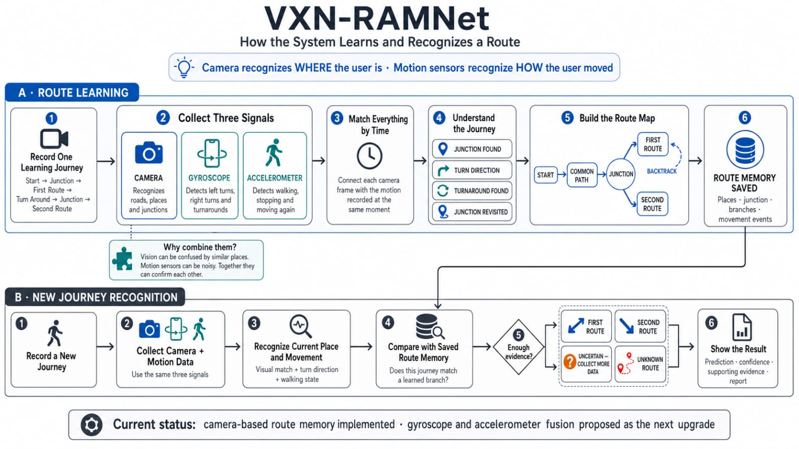

# VXN-RAMNet

**VisionX Routine Adaptive Memory Network** is a research prototype for learning and recognizing a constrained visual route pattern without GPS:

`common path → junction → Branch A → turnaround → junction revisit → Branch B`

> **Status:** active research prototype. The repository implements a camera-only, offline baseline. It does not yet implement the complete VisionX smart-spectacles system and must not be used as a sole navigation or safety system.



## Current objective

The immediate research objective is to make the camera baseline reproducible, measurable, and scientifically defensible before adding IMU fusion, Android streaming, wearable hardware, ultrasonic supervision, or assistive guidance.

## Implemented now

- Validated video input and deterministic frame sampling.
- Frozen EfficientNetB0 embeddings for original and horizontally flipped frames.
- Flip-aware self-similarity analysis.
- Constrained junction-revisit and turnaround detection.
- Route-memory segmentation into common path, junction, Branch A, backtrack, and Branch B.
- Multi-window query scoring with known, uncertain, and unknown decisions.
- Safe NPZ/JSON artifacts, run-scoped outputs, reports, logs, and manifests.
- Command-line runner, optional local Streamlit interface, and regression tests based on the verified Notebook 4 sample.

## Important limitations

- The topology is limited to one junction and two branches.
- Branch A/B describe exploration order, not physical left/right direction.
- Thresholds are research defaults, not calibrated probabilities.
- Processing is offline and post-hoc, not real-time.
- The bundled regression fixture verifies implementation fidelity, not generalization.
- No representative-user, accessibility, safety, or field validation has been completed.

See [Project status](docs/project-status.md) for the exact implemented, partial, and not-started scope.

## Repository structure

```text
VXN-RAMNet/
├── apps/                       # Optional local research UI
├── assets/architecture/        # Current and target architecture diagrams
├── configs/                    # Reproducible experiment configurations
├── docs/                       # Focused research and engineering documentation
├── research/                   # Historical notebooks and experiment protocol
├── scripts/                    # Small command wrappers
├── src/vxn_ramnet/             # Executable package
├── tests/                      # Unit, integration, and regression tests
├── pyproject.toml              # Packaging, dependencies, and tool settings
└── README.md
```

The source package is divided only where responsibilities are genuinely different:

- `algorithms/`: numerical similarity, junction, turnaround, segmentation, scoring, and decision logic.
- `config/`: strict experiment configuration and loading.
- `io/`: safe paths, video handling, atomic files, NPZ handling, and schema validation.
- `memory/`: versioned route-memory representation and storage.
- `pipeline/`: executable experiment stages and artifact layout.
- `reporting/`: machine-readable and human-readable result generation.
- `vision/`: preprocessing and visual-encoder adapters.

Future VisionX modules are documented but intentionally not represented as empty implementation stubs.

## Installation

Python 3.11 or 3.12 is recommended.

```bash
python -m venv .venv
```

Activate the environment:

```bash
# Windows
.venv\Scripts\activate

# Linux or macOS
source .venv/bin/activate
```

Install the camera pipeline:

```bash
python -m pip install --upgrade pip
pip install -e ".[vision]"
```

For development and testing:

```bash
pip install -e ".[dev]"
```

For notebooks:

```bash
pip install -e ".[research]"
```

## Run an experiment

1. Copy the baseline configuration.
2. Update the learning and query video paths.
3. Validate the configuration.
4. Run the pipeline.

```bash
cp configs/camera_baseline.yaml configs/local.yaml
vxn-ramnet validate-config --config configs/local.yaml
vxn-ramnet run --config configs/local.yaml
```

On Windows PowerShell, use:

```powershell
Copy-Item configs/camera_baseline.yaml configs/local.yaml
```

Generated outputs are placed under:

```text
artifacts/runs/<run-id>/
```

The pipeline validates all inputs before creating or replacing a managed run directory. It does not recursively clean arbitrary user-selected folders.

## Optional local UI

```bash
pip install -e ".[vision,ui]"
streamlit run apps/streamlit_app.py
```

The UI is intended only for local research demonstrations. It is not an authenticated multi-user service.

## Verification

```bash
ruff check src tests scripts apps
mypy src/vxn_ramnet
pytest
```

The regression test protects the verified Notebook 4 baseline indices and branch classifications. It must not be interpreted as independent model evaluation.

## Documentation

- [Project status](docs/project-status.md)
- [Current camera architecture](docs/architecture/current-camera-baseline.md)
- [Target VisionX architecture](docs/architecture/target-visionx-system.md)
- [Implementation roadmap](docs/implementation-roadmap.md)
- [Evaluation plan](docs/evaluation-plan.md)
- [Artifact contract](docs/artifact-contract.md)
- [Technical-debt status](docs/technical-debt.md)
- [Safety and limitations](docs/safety-and-limitations.md)
- [Research notebooks and experiment protocol](research/README.md)

## Research integrity

Do not report the system as production-ready, medically validated, safety-certified, or generally accurate. Every performance claim must identify the dataset, participant/environment split, metric, configuration, model version, and evaluation date.

## License and citation

Released under the MIT License. Use [`CITATION.cff`](CITATION.cff) when citing a specific repository revision.
