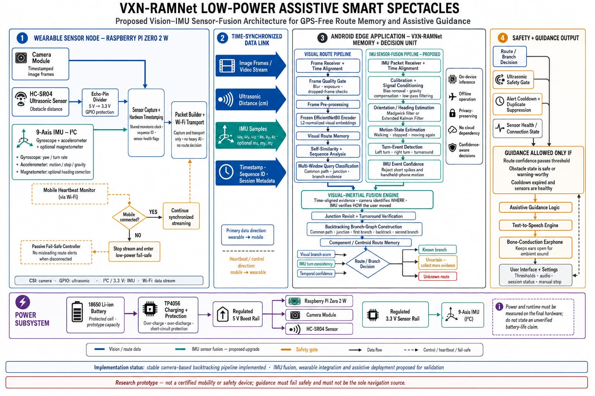

# Target VisionX system architecture

## System boundary

**VisionX** is the proposed complete assistive smart-spectacles system. **VXN-RAMNet** is intended to become the Android-edge route-memory, multimodal-fusion, uncertainty, and branch-decision module inside VisionX.

The current repository implements only the offline camera baseline. The architecture below is a target to be developed and validated incrementally.

## 1. Wearable sensor node

Proposed prototype hardware:

- Raspberry Pi Zero 2 W for sensor acquisition, timestamping, packetization, and transport only.
- Camera module producing timestamped image frames.
- 9-axis IMU over I²C:
  - Gyroscope for yaw/turn-rate evidence.
  - Accelerometer for movement, stopping, and gravity evidence.
  - Optional magnetometer for heading correction where magnetic quality is acceptable.
- HC-SR04 or a safer/easier-to-integrate distance sensor for supervisory obstacle distance.
- Protected power, charging, and regulated voltage rails.

The Raspberry Pi must not make route decisions or run the main route-recognition model. This keeps the wearable node simpler and moves inference, memory, and user interaction to the Android device.

### Electrical boundary

The HC-SR04 echo signal is 5 V and must not connect directly to 3.3 V Raspberry Pi GPIO. A verified divider or level-shifting solution is required. Final sensor selection should consider voltage compatibility, minimum range, beam pattern, reliability, mounting, and power consumption.

## 2. Time-synchronized data link

The wearable-to-mobile protocol must carry:

- Session and device identifiers.
- Packet type and schema version.
- Monotonic capture timestamp.
- Sequence number.
- Image-frame metadata and payload/reference.
- Gyroscope, accelerometer, and optional magnetometer samples.
- Distance value and validity status.
- Sensor-health flags.
- Link/heartbeat information.

Required protocol behavior:

- Detect missing and duplicate packets.
- Reorder within a bounded window or reject late data.
- Expire stale evidence.
- Estimate/monitor clock offset and drift.
- Reconnect without merging unrelated sessions.
- Stop or enter low-power fail-safe behavior when the mobile heartbeat expires.

A packet simulator should be built and tested before physical wearable integration.

## 3. Android edge application

### Visual pipeline

1. Packet/frame receiver.
2. Time alignment.
3. Blur, exposure, occlusion, and dropped-frame quality gate.
4. Preprocessing.
5. Mobile visual encoder.
6. Incremental route memory.
7. Sequence and revisit analysis.
8. Bounded multi-window or sequential branch evidence.

The mobile encoder format must be selected through TFLite/ONNX/mobile-runtime benchmarks rather than assumed in advance.

### IMU pipeline

1. Packet validation and time alignment.
2. Bias calibration.
3. Gravity compensation and filtering.
4. Motion-state estimation.
5. Turn and turnaround event detection.
6. Quality checks for spikes, drift, magnetic disturbance, and device handling artifacts.
7. Event confidence and rejection reasons.

The camera estimates **where** the user is; inertial evidence estimates **how** the user moved. Each modality must retain separate scores and quality information.

### Visual-inertial fusion

The fusion layer should:

- Confirm or reject junction-revisit candidates.
- Confirm turnaround timing.
- Check branch-turn consistency.
- Preserve modality disagreement.
- Return known, uncertain, unknown, or sensor-degraded outcomes.
- Accumulate evidence sequentially rather than selecting the best window from a completed journey.

Fusion is justified only if held-out ablations show improvement over visual-only and IMU-only systems.

## 4. Route memory and decision state

A future route-memory record should include:

- Route, session, and schema identifiers.
- Visual model and preprocessing versions.
- Sensor calibration and hardware metadata.
- Time-base and synchronization metadata.
- Component/graph representations.
- Per-modality quality and evidence.
- Decision thresholds and calibration version.
- Creation/update provenance.

The initial VisionX topology may retain the constrained one-junction/two-branch graph. General multi-junction routing should not be claimed until graph learning, place aliasing, loops, route updates, and graph search are independently implemented and evaluated.

## 5. Safety supervision

Route inference and obstacle warning must remain separate.

Guidance is allowed only when all required gates pass:

- Route decision has sufficient validated evidence.
- Data is fresh and ordered.
- Required sensors and link are healthy.
- The current state permits guidance.
- Cooldown and duplicate-suppression rules permit an alert.
- Obstacle state is handled by a separately defined rule.

A distance sensor can warn about some nearby obstacles; it cannot prove that a path is safe or detect every relevant hazard.

## 6. Guidance and user interaction

Proposed output path:

- Decision/safety supervisor.
- Text-to-speech.
- Bone-conduction or another accessibility-reviewed audio output.
- Mobile controls for learning, recognition, pause, stop, status, volume, and data deletion.

The user must receive clear states such as collecting evidence, uncertain, unknown route, sensor degraded, disconnected, and stopped—not only successful branch announcements.

## 7. Runtime state machine

Minimum states:

- Disconnected/fail-safe.
- Connecting.
- Calibration.
- Ready.
- Learning.
- Recognition.
- Collecting evidence.
- Known branch.
- Uncertain.
- Unknown route.
- Obstacle warning.
- Sensor degraded.
- Session stopped.

Every transition must define required inputs, timeouts, allowed outputs, persisted state, and fail-safe behavior.

## 8. Power and physical integration

The prototype concept includes a protected Li-ion battery, charging/protection, regulated 5 V for Raspberry Pi/camera/distance sensing, and a regulated 3.3 V sensor rail where required.

No battery-life claim is valid before measurement on final hardware. Physical work must measure:

- Total mass and weight distribution.
- Heat near the face/head.
- Cable and connector strain.
- Enclosure strength and water exposure risk.
- Charge/discharge behavior.
- Continuous and peak current.
- Runtime under actual streaming load.

An 18650 cell may be useful for bench prototyping but is not automatically an acceptable final spectacles integration.

## Non-negotiable boundaries

- Offline/privacy-preserving operation is a product objective, not yet a completed Android implementation.
- Magnetometer use is optional because indoor magnetic interference can be severe.
- Link loss and stale data suppress guidance.
- Sensor health and uncertainty are part of the core architecture.
- VisionX must not be the sole navigation source during research testing.
- No assistive-safety claim is valid until representative evaluation and independent review exist.
